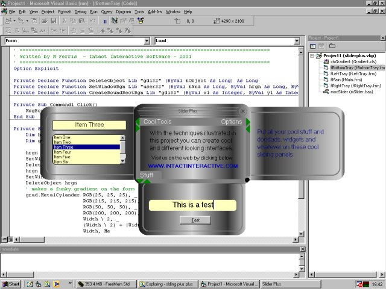

<div align="center">

## Skins & Sliding Trays \- part 3


</div>

### Description

Skinned windows with recracting trays that move with the window - a la Windows Media Player.

Fixed the unaccessable trays problem plus added some shape changing to standard controls....
 
### More Info
 


<span>             |<span>
---                |---
**Submitted On**   |2001-09-08 17:00:28
**By**             |[Meltdown Charlie](https://github.com/Planet-Source-Code/PSCIndex/blob/master/ByAuthor/meltdown-charlie.md)
**Level**          |Intermediate
**User Rating**    |4.9 (39 globes from 8 users)
**Compatibility**  |VB 4\.0 \(32\-bit\), VB 5\.0, VB 6\.0
**Category**       |[Graphics](https://github.com/Planet-Source-Code/PSCIndex/blob/master/ByCategory/graphics__1-46.md)
**World**          |[Visual Basic](https://github.com/Planet-Source-Code/PSCIndex/blob/master/ByWorld/visual-basic.md)
**Archive File**   |[Skins & Sl26101982001\.zip](https://github.com/Planet-Source-Code/meltdown-charlie-skins-sliding-trays-part-3__1-27060/archive/master.zip)

### API Declarations

```
Private Declare Function DeleteObject Lib "gdi32" (ByVal hObject As Long) As Long
Private Declare Function SetWindowRgn Lib "user32" (ByVal hWnd As Long, ByVal hrgn As Long, ByVal bRedraw As Boolean) As Long
Private Declare Function CreateRoundRectRgn Lib "gdi32" (ByVal x1 As Integer, ByVal y1 As Integer, ByVal x2 As Integer, ByVal y2 As Integer, ByVal x3 As Integer, ByVal y3 As Integer) As Long
Private Declare Function ExtCreateRegion Lib "gdi32" (lpXform As Any, ByVal nCount As Long, lpRgnData As Any) As Long
Private Declare Sub ReleaseCapture Lib "user32" ()
Private Declare Function DeleteObject Lib "gdi32" (ByVal hObject As Long) As Long
Private Declare Function SetWindowRgn Lib "user32" (ByVal hWnd As Long, ByVal hrgn As Long, ByVal bRedraw As Boolean) As Long
Private Declare Function SendMessage Lib "user32" Alias "SendMessageA" (ByVal hWnd As Long, ByVal wMsg As Long, ByVal wParam As Long, lParam As Any) As Long
Private Declare Function ShellExecute Lib "shell32.dll" Alias "ShellExecuteA" (ByVal hWnd As Long, ByVal lpOperation As String, ByVal lpFile As String, ByVal lpParameters As String, ByVal lpDirectory As String, ByVal nShowCmd As Long) As Long
```


